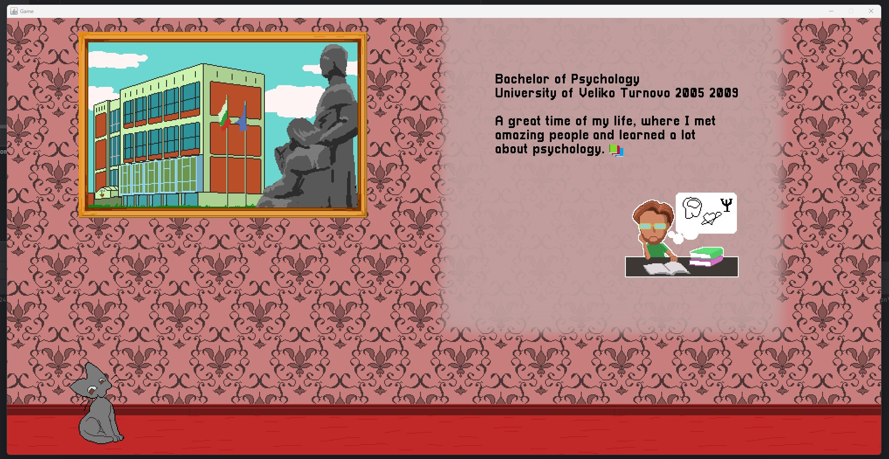

# Interactive Resume

Hello, my name is Tomi Tsolov. This is an app a build with Java using the Java Swing GUI that's part of the standard library.
You should be able to compile and run it without much effort.

:one: Install Java Runtime Environment version 24 or higher 
    - [Java Runtime Windows](https://www.oracle.com/java/technologies/downloads/#jdk24-windows)
    - [Java Runtime Linux](https://www.oracle.com/java/technologies/downloads/#jdk24-linux)
      
`Note:  Unfortunately I haven't had the chance to test this on Lunix.`

 :two: Use an IDE like [IntelliJ IDEA](https://www.jetbrains.com/idea/download/?section=windows) or [Eclipse](https://www.eclipse.org/downloads/) to compile and run the code

Other IDEs also work as long you make sure they can run Java code. In the ones above do it natively.

That should be enough. I hope you like it. :kissing_cat:

 
